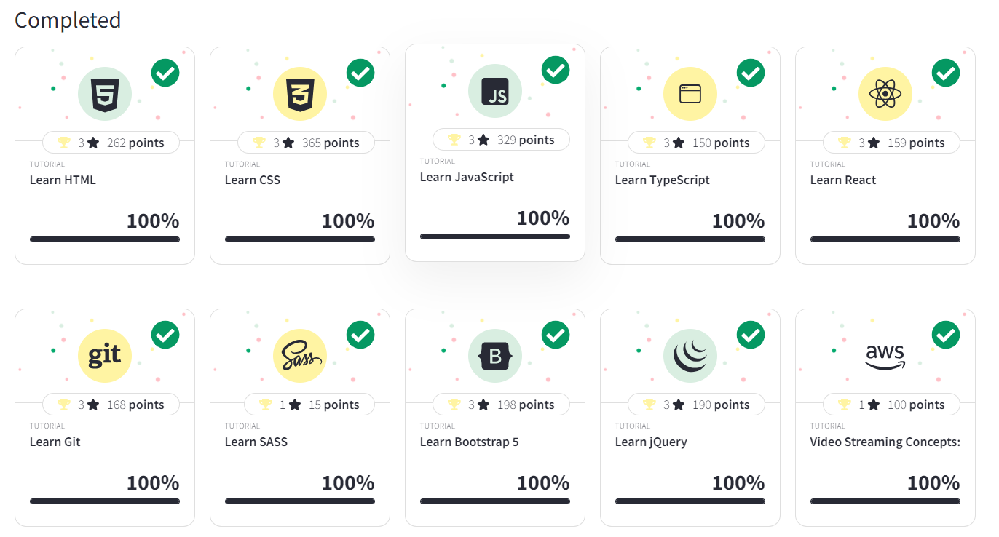

# Hi, I'm Hamid! 👋

## 🚀 About Me

I'm a junior react developer

## 🔗 Links

[](https://niklinkagency.com/projects)

[](https://www.linkedin.com/in/hamidft/)

[](https://codepen.io/YourCodePenUsername)

## Other Common Github Profile Sections

👩‍💻 I'm currently working on admin dashboard project see [here](https://github.com/hamid-Ft/admin-dashboard)

🧠 I'm currently learning nextJs

🤹🏻‍♂️ i've mastered css-plate , grid garden , flex zombies, css battle , w3school ,free codecamp ui courses


## 🛠 Skills

WordPress dev , React , tailwind

# Tali-Mock

This is a [Next.js](https://nextjs.org/) project bootstrapped with [`create-next-app`](https://github.com/vercel/next.js/tree/canary/packages/create-next-app). try to show cases my UI skills on creating mock form two pages of [tali.ai website](https://tali.ai)


## Installation

1. Clone the repository:

   ```bash
   git clone https://github.com/hamid-Ft/tali-mock.git
   ```

2. Change to the project directory:

   ```bash
   cd tali-mock
   ```

3. Install the project dependencies using [npm](https://www.npmjs.com/):

   ```bash
   npm install
   ```

## Usage

1. Start the development server:

   ```bash
   npm run dev
   ```

2. Open your browser and navigate to [http://localhost:3000](http://localhost:3000)
3. explore tali install and oscarPro page

## Author

- [@hamid-Ft](https://www.github.com/hamid-Ft)

For additional information or questions, feel free to contact me:

- Email: hamidfattahi.a@gmail.com

Enjoy exploring tali-mock App!

## Getting Started

First, run the development server:

```bash
npm run dev
# or
yarn dev
# or
pnpm dev
# or
bun dev
```

Open [http://localhost:3000](http://localhost:3000) with your browser to see the result.

This project uses [`next/font`](https://nextjs.org/docs/basic-features/font-optimization) to automatically optimize and load Inter, a custom Google Font.

## Learn More

To learn more about Next.js, take a look at the following resources:

- [Next.js Documentation](https://nextjs.org/docs) - learn about Next.js features and API.
- [Learn Next.js](https://nextjs.org/learn) - an interactive Next.js tutorial.

You can check out [the Next.js GitHub repository](https://github.com/vercel/next.js/) - your feedback and contributions are welcome!

## Deploy on Vercel

The easiest way to deploy your Next.js app is to use the [Vercel Platform](https://vercel.com/new?utm_medium=default-template&filter=next.js&utm_source=create-next-app&utm_campaign=create-next-app-readme) from the creators of Next.js.

Check out our [Next.js deployment documentation](https://nextjs.org/docs/deployment) for more details.

## License

This project is licensed under the MIT License. See the [LICENSE](LICENSE) file for details.

[](https://choosealicense.com/licenses/mit/)
